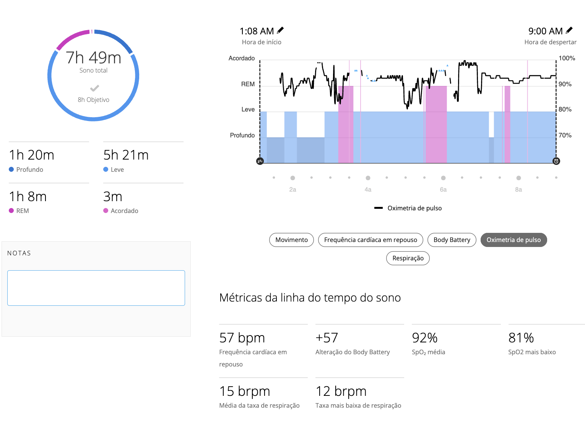

# Diário BRH — 2025-09-28

**Data:** 2025-09-28  
**Participante:** Débora Lutz  
**Resumo do Dia:** Recuperação tranquila, acompanhada de observação atenta dos sinais físicos (mãos/unhas) e métricas Garmin.

---

## 💤 Sono
- **Duração total:** 7h49
- **Estágios:** Profundo 1h20 / Leve 5h21 / REM 1h08 / Acordada 3min
- **Eventos relevantes:** SpO₂ mínima 81% durante a madrugada (média 92%).

---

## 🌡️ Fisiologia
| Métrica                 | Valor          | Observações                                              |
|-------------------------|----------------|----------------------------------------------------------|
| HRV (média noite)       | —              | (não disponível no resumo do Garmin)                     |
| Frequência cardíaca rep | 57 bpm         | Dentro da faixa habitual                                 |
| Body Battery ao acordar | +57 (noite); 47/100 ao meio-dia | Recuperação adequada, drenagem ligada a estresse emocional |
| SpO₂ média (noite)      | 92 %           | Registrar quedas abaixo de 88 % se persistirem           |
| SpO₂ média (dia)        | 92 % (leituras contínuas) | Ajuste de sensor concluído para acompanhar durante o dia |

---

## 🧠 Estresse & Humor
- **Score Garmin:** —
- **Distribuição:** — (não informado pelo app neste dia)
- **Humor subjetivo:** Estável, mesmo com sinais físicos a monitorar.
- **Observações:** Estresse percebido como emocional/ambiental; sem esforço físico significativo.

---

## 📝 Anotações Pessoais
- Unhas e cutículas com aspecto mais rugoso.
- Dedos e parte da mão esquerda com leve perda de sensibilidade (desde alguns meses).
- Ambiente atual reconhecido como fator de estresse emocional; reforçada a intenção de mudança.

---

## 📎 Anexos
- [Resumo PDF](2025-09-28-resumo-diario.pdf)
- [Diário do Sono PDF](2025-09-28-diario-do-sono.pdf)
- [CSV do sono](2025-09-28-sono.csv)
- Gráficos:  
  - 

---

**Como usar:**
1. Atualize com novas medições caso surjam (HRV, stress score, etc.).
2. Gere PDFs e gráficos adicionais com o mesmo prefixo de data para manter a convenção.
