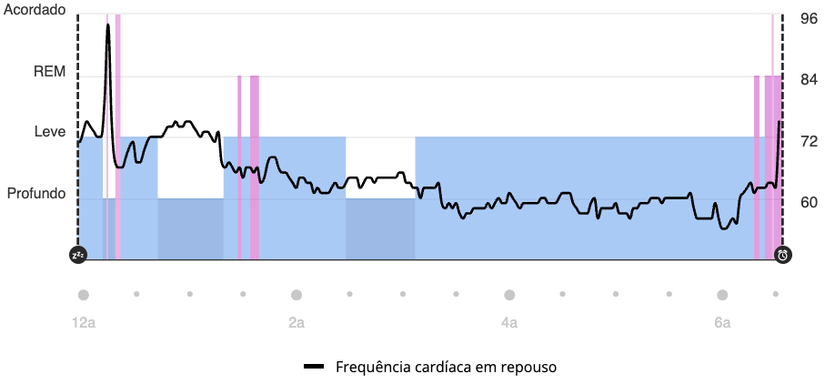
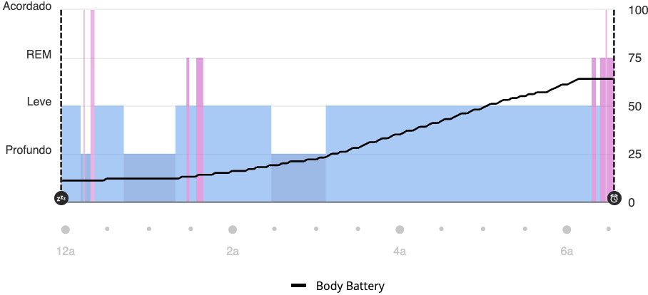
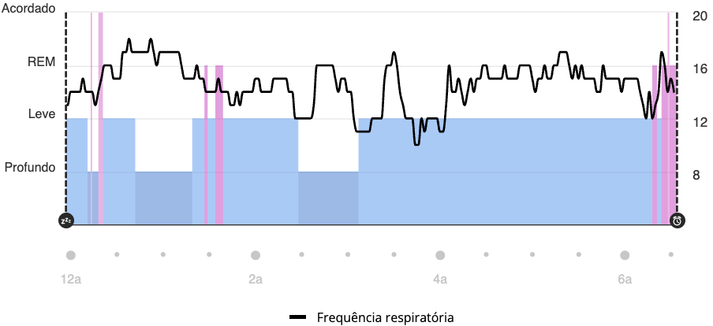
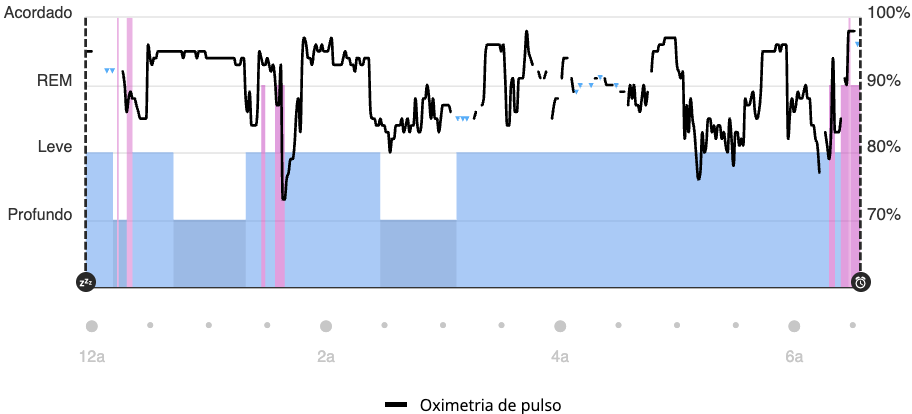
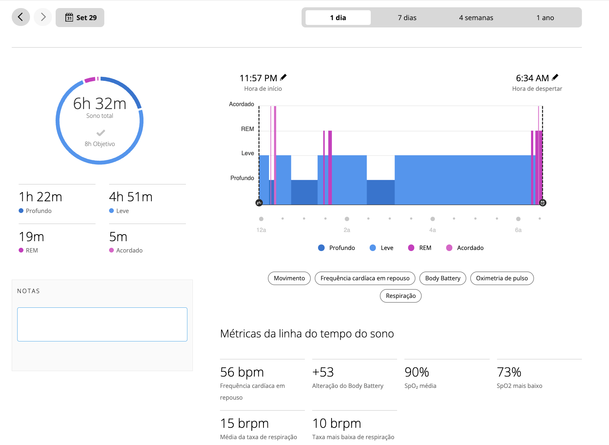

# Diário BRH — 2025-09-29

**Data:** 2025-09-29  
**Participante:** Débora Lutz  
**Resumo do Dia:** Manhã de recuperação após noite curta; observação atenta das métricas respiratórias e de oxigenação.

---

## 💤 Sono
- **Duração total:** 6h32
- **Estágios:** Profundo 1h22 / Leve 4h51 / REM 19min / Acordada 5min
- **Eventos relevantes:** SpO₂ mínima de 73% durante a madrugada; sono abaixo da meta (8h).

---

## 🌡️ Fisiologia
| Métrica                 | Valor          | Observações                                      |
|-------------------------|----------------|--------------------------------------------------|
| HRV (média noite)       | —              | (não informado pelo aplicativo)                  |
| Frequência cardíaca rep | 56 bpm         | Dentro da faixa típica                           |
| Body Battery ao acordar | +53 (recarga); nível 47/100 ao meio-dia | Queda ao longo da manhã por carga emocional |
| SpO₂ média (noite)      | 90 %           | Registrar quedas abaixo de 88 % se recorrentes   |
| SpO₂ média (dia)        | —              | Leituras contínuas ativadas                      |

---

## 🧠 Estresse & Humor
- **Score Garmin:** —
- **Distribuição:** —
- **Humor subjetivo:** Estável, com foco em autorregulação suave.
- **Observações:** Sem esforço físico relevante; estresse percebido como ambiental/situacional.

---

## 📝 Anotações Pessoais
- Sensação de leve baixa de vitalidade após despertar precoce.
- Atenção contínua às leituras de SpO₂; intenção de agendar avaliação médica.
- Uso de respiração 4-6 e pausas conscientes ao longo do dia.

---

## 📎 Anexos
- [Resumo PDF](2025-09-29-resumo-diario.pdf)
- [Diário do Sono PDF](2025-09-29-sono.pdf)
- [CSV do sono](2025-09-29-sono.csv)
- Gráficos:  
  - 
  - 
  - 
  - 
  - 

---

**Como usar:**
1. Atualize com novas medições (HRV, score de estresse) caso o aplicativo disponibilize.
2. Gere PDFs e gráficos adicionais com o mesmo prefixo de data para manter a convenção.
